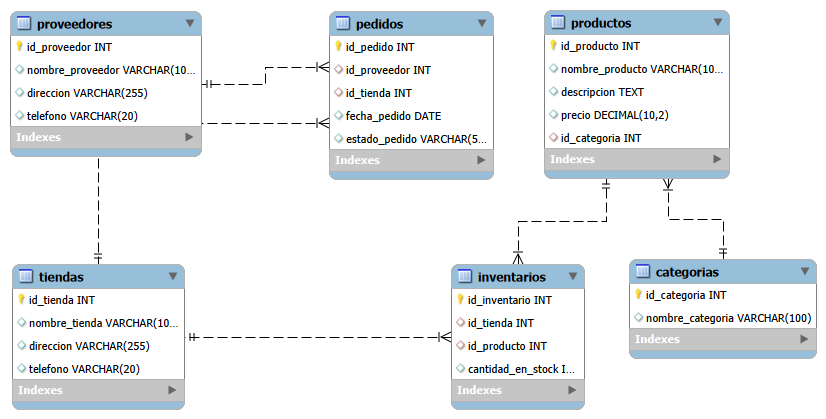

# 🏬 SQL · Modelo entidad-relación de una cadena de tiendas


Base de datos relacional para una cadena de tiendas que administra **tiendas, categorías, proveedores, productos, inventarios y pedidos**.

> Ejercicio del **Bootcamp Full Stack Java (2026)**.

## 🗺️ Diagrama entidad-relación



## 🧱 Tablas

`Tiendas` · `Categorias` · `Proveedores` · `Productos` · `Inventarios` · `Pedidos`

## 🧠 Conceptos aplicados

- Normalización y separación de entidades.
- Tablas intermedias para relacionar productos con tiendas (inventario).
- Claves primarias y foráneas para mantener la integridad de los datos.

## ▶️ Cómo ejecutarlo

```bash
mysql -u root -p < codigo_tiendas.sql
```

---

## 👩‍💻 Autora

**Evelyn Álvarez Vásquez** · Técnica en Informática en formación (IPLACEX) · Profesora y Magíster en Didáctica de la Matemática

[](https://www.linkedin.com/in/profesoraevelyn/)
[](https://github.com/evelyntec)
[](https://profesoraevelyn.com)
